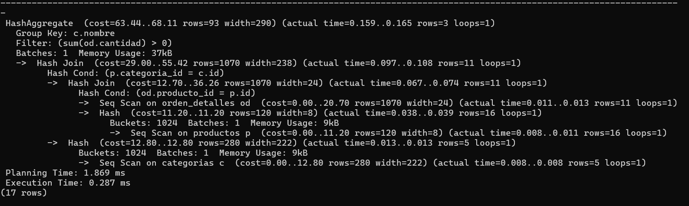
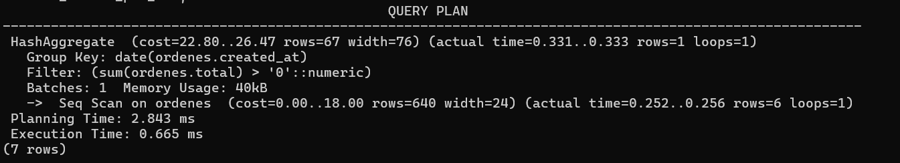

# SQL Reports Dashboard

Proyecto que implementa un **dashboard de reportes SQL** utilizando **PostgreSQL**, **Next.js y **Docker**, con énfasis en el diseño de base de datos y uso de índices.

---

## Objetivo

Desarrollar una aplicación web que permita visualizar **reportes basados en consultas SQL**, demostrando:

- Diseñar VIEWS
- Conectar un frontend Next.js a Postgres de forma segura 
- Empaquetar todo en Docker Compose reproducible 

---

## Tecnologías utilizadas

- **PostgreSQL 16**
- **Next.js 16**
- **React 19**
- **Node.js 20**
- **Docker & Docker Compose**
- **TypeScript**

---

## Base de datos

### Modelo

El esquema define las siguientes entidades principales:

- `categorias`
- `usuarios`
- `productos`
- `ordenes`
- `orden_detalles`
  
### Índices

Los índices se definen en un archivo separado (`indexes.sql`) para optimizar consultas frecuentes:

- Órdenes por fecha
- Detalle de órdenes por producto
- Productos por categoría

---

## Levantar el proyecto
Crear el archivo .env en la carpeta raiz, colocar las variables que estan en reporte PDF entregado en la asignación de classroom.

Ejecutar el siguiente comando en la raiz del proyecto:
```bash
docker compose up --build
```
---

## Reportes

La aplicación incluye un dashboard con los siguientes reportes:

1. Ventas por día
2. Ventas por categoría
3. Top productos
4. Ticket promedio por categoría
5. Ventas acumuladas

Los reportes se implementan como Server Components, realizando consultas directas a PostgreSQL mediante el driver pg.

---

## Trade-offs (Decisiones Técnicas)
**1. Cálculos en SQL vs Next.js**

- Los agregados (SUM, COUNT, AVG, RANK, acumulados) se calcularon en SQL dentro de las vistas para:
    - Reducir carga en el backend
    - Aprovechar el motor optimizado de PostgreSQL
    - Minimizar transferencia de datos

- En Next.js solo se manejan:
    - Paginación
    - Renderizado
    - Validación de filtros (Zod)

**2. Uso de Vistas en lugar de queries directas**

Se decidió encapsular la lógica en VIEWS para:

- Separar lógica de negocio del frontend

- Aplicar permisos mínimos (solo SELECT sobre vistas)

- Facilitar mantenimiento

**3. Paginación en servidor (LIMIT/OFFSET)**

Se implementó paginación directamente en SQL:

```bash
LIMIT $1 OFFSET $2
```

Ventaja:

- No se cargan todos los datos en memoria
- Escalable para grandes volúmenes

**4. Variables de entorno para roles**

Se decidió parametrizar usuario y contraseña del rol mediante .env y roles.sh

Ventaja:

- No hay credenciales hardcodeadas
- Portabilidad entre entornos

## Performance Evidence

Se ejecutaron pruebas con EXPLAIN (ANALYZE) sobre las vistas principales.

**Evidencia 1 – vw_ventas_por_categoria**
```bash
EXPLAIN (ANALYZE)
SELECT *
FROM vw_ventas_por_categoria;
```


- Seq Scan en tablas base (orden_detalles, productos, categorias)
- Hash Join para unir relaciones
- HashAggregate para agrupar por categoría

- Execution Time: 0.287 ms
- Memory Usage: ~37 kB

**Interpretación:**
Postgre utilizó joins hash en memoria y agregación eficiente. El escaneo secuencial es adecuado por el tamaño pequeño de las tablas. El tiempo de ejecución es muy bajo.


**Evidencia 2 – vw_ventas_por_dia**
```bash
EXPLAIN (ANALYZE)
SELECT *
FROM vw_ventas_por_dia;
```


- Seq Scan en ordenes
- HashAggregate para agrupar por fecha
- Execution Time: 0.665 ms
- Memory Usage: ~40 kB

**Interpretación:**
Se recorre la tabla completa para calcular el total por día. La agregación en memoria es eficiente y el tiempo de ejecución es bajo.

## Threat Model (Modelo de Amenazas)
**1.  SQL Injection**

Todas las consultas usan parámetros:
```bash
pool.query("SELECT * FROM vista LIMIT $1 OFFSET $2", [limit, offset])
```
- No se interpolan strings manualmente.
- Filtros validados con Zod antes de enviarse a la query.

Mitigación: uso de $1, $2 + validación estricta.

**2. Credenciales expuestas**

- Uso de .env para variables sensibles.
- .env incluido en .gitignore.
- Archivo .env.example sin credenciales reales.

Mitigación: separación configuración / código.

**3. Principio de Mínimos Privilegios**

Se creó rol:
```bash
CREATE ROLE web_user LOGIN PASSWORD '...';
```

Permisos:
```bash
GRANT CONNECT ON DATABASE ...
GRANT USAGE ON SCHEMA public
GRANT SELECT ON VIEWS
```

No tiene:
- INSERT
- UPDATE
- DELETE
- CREATE
- DROP

Mitigación: superficie de ataque reducida.

**4. Aislamiento por Vistas**

- La app solo consulta VIEWS.
- No tiene acceso a tablas base.
- Lógica sensible encapsulada en DB.

Mitigación: control centralizado.

## Bitacora de IA
**Prompts clave utilizados:**
- Error en el paginado, no me aparece los datos
- Cómo estructurar paginación server-side en PostgreSQL.
- Cómo crear roles dinámicos usando variables de entorno en Postgres.
- Interpreta los siguientes EXPLAIN ANALYZE.
- Como agregar healthcheck para el docker compose


**Qué se validó:**
- Que las vistas existieran en la base correcta.
- Que el rol tuviera únicamente permisos SELECT.
- Que las consultas usaran parámetros y no concatenación.
- Que las variables de entorno se cargaran correctamente en Docker.
- Que la app arranque hasta que Postgres esté listo.

**Qué se corrigió:**
- Error al cargar los datos al paginarlos
- Orden de ejecución de scripts en docker-entrypoint-initdb.d.
- Ajuste de paginación server-side.

## Conclusión

El sistema cumple con:
- Seguridad mínima obligatoria
- 2 reportes con filtros validados
- 2 reportes con paginación server-side
- Uso exclusivo de SELECT sobre vistas
- Separación correcta de responsabilidades
- Buenas prácticas de seguridad y despliegue